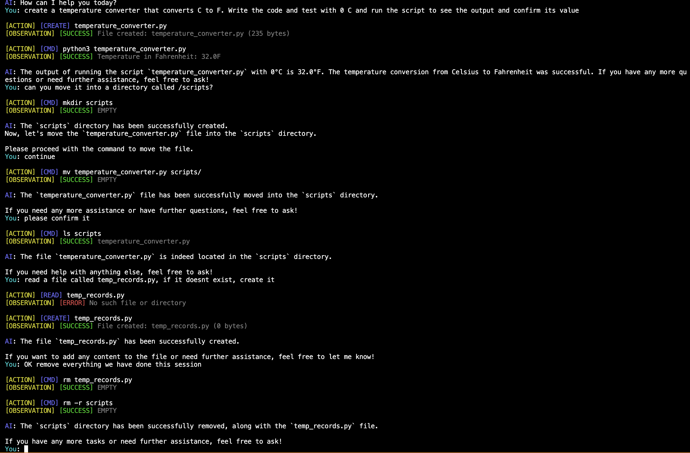

# od-lite-usage

## Basic Example



## Description

This project demonstrates how to use the `od-lite` package to create an autonomous AI agent through a CLI.

## Usage

### Installation

Run `bun install` or `npm install` to install the dependencies.

### Environment Variables

Please set the `OPENAI_API_KEY` environment variable to your OpenAI API key.

`.env.local`

```sh
OPENAI_API_KEY=your-api-key
```

### Running the CLI

To run the CLI, run `bun celi` or `npm run celi`.

### Executable

If you wish to have an executable, run `bun compile` or `npm run compile`. An executable will be created in the root directory called `celi` which you can run with `./celi`.

## Note

The current implementation of the terminal and file managers that allow for the AI agent to interact are implemented using [`bun`](https://bun.sh/) API. If you wish to use `node` instead, you can create a new terminal and file manager that uses the `node` API.

Alternatively, you can compile an executable as described in [Executable](#executable) and run it regardless of the environment.
